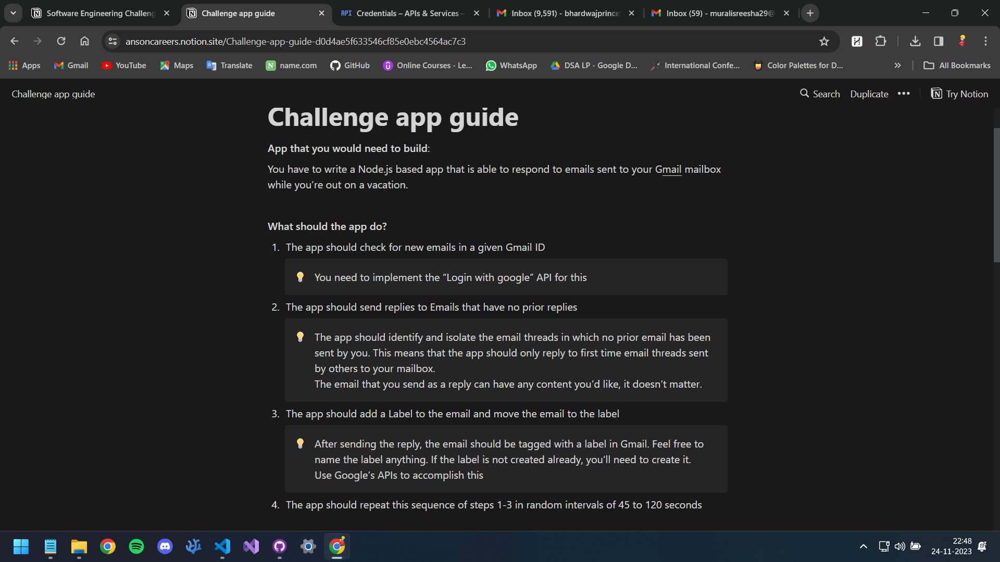

# mailbot

> Description: MailBot checks your emails and sends a reply to any unread emails.

**Software/Packages Used:** NodeJS(_completely built on_), VScode(_IDE_), Gmail API(_to send _replies_), and OAuth 2.0(_access to my mailbox_).

## What does MailBot do 👇

- [x] Check for new emails in a given Gmail ID (_IMPLEMENTED "LOGIN WITH GOOGLE" API_).
- [x] Send replies to Emails that have no prior replies.
- [x] Add a Label to the email and move the email to the label (_onvacation_).
- [x] Interval set of 45 to 120 seconds.

## Tested Properly 👇

- [x] Used my own Gmail to write and test the app (_USED THE FAKE GMAIL ACCOUNT FOR THIS DEMO_).
- [x] There are no double replies sent to any email at any point (_CHECKED_).
- [x] Tested on `https://developers.google.com/oauthplayground`.

## Technical Guidelines 👇

- [x] Use Google APIs to implement the app.
- [x] Build this app on Node.js.
- [x] Use modern JavaScript standards while coding.
- [x] Use Promises, async/await wherever possible to avoid callback hell and unreadable code.
- [x] Write clean code, add comments wherever needed.
- [x] write a note on areas where your code can be improved.

## Code can be still improved 👇

- **Error Handling:** The code currently logs any errors that occur during execution, but it does not handle them in a way that allows the program to continue running.
- **Code Organization:** The code is currently written in a single file, which can make it difficult to maintain and understand. It would be better to modularize the code into separate files or functions.
- **Configuration Management:** The code currently imports the Gmail API credentials directly from a file. It would be better to use a configuration management system, such as environment variables.

## Screenshots

